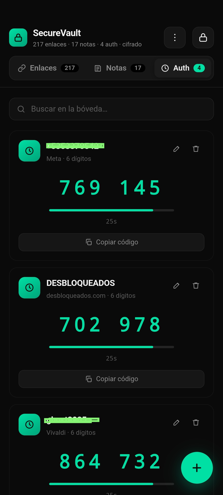

# svault 
Bóveda cifrada SecureVault ...

**SecureVault** es una bóveda de contraseñas y notas seguras que funciona **100% en tu dispositivo**. Sin servidores, sin cuentas, sin telemetría. Todo el cifrado ocurre localmente mediante la **Web Crypto API** y los datos se almacenan cifrados en el `localStorage` de la app o se exportan como archivo `.json` cifrado.

```text
Cifrado: AES-256-GCM
Derivación: PBKDF2-SHA256 · 300.000 iteraciones
Ubicación: Almacenamiento de la app
Elementos: enlaces · notas · TOTP
```

### 🧮 Vista previa


